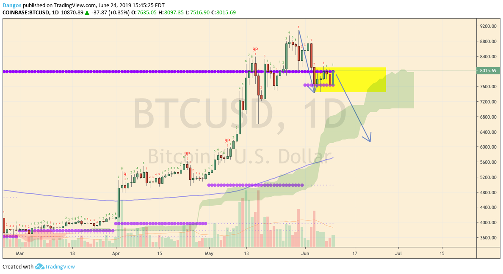

TLDR; made 40% the first week and lost 100% the next

Continue reading for an in-depth analysis of my trades.

---

## First Week: Euphoria

After losing 30% off my first trade, I scalped endlessly to chase those pips and managed to recover back to \$100.

Looking at the chart, I thought Bitcoin was at the second wave of Elliot theory and there is more room to go down. Thus, it is safe to enter a short positions.

21 trades later with little to no sleep, I managed to not only breakeven and also get 40% gains. I felt like I was on top of the world and have broke the system.

---

## Second Week: Denial

After my little success, I stopped putting in stop loss because I thought the range market will continue this week, and the general outlook of bitcoin being downwards. I couldn't have been more wrong..

Bitcoin defied all logic and continued to go up 9 days straight and throughout this bull run, I was in denial and thought a correction was due soon. This caused my positions to be margin called, and resulting in wiping my account out.

On the bright side, I entered this market well knowing I can lose it all and thus reduced my inital balance to \$100, but then again, I did not expect to wipe my account in 2 weeks. This is a new learning experience for me, but it definitely won't stop me from trying again.

---

## Corollary

After taking a week break from losing everything, I have decided to put another \$100 into my account and try day trading again.

Below are my key guidelines for moving forward:

- **STOP LOSS**: I'd rather lose 30% than 100%
- **Never enter bet against bitcoin**: people are irrational beings, they are more than happy buying expensive bitcoin than buying it when it is discount
- **experiment with lot sizes above 0.01** so I can take partial profit
