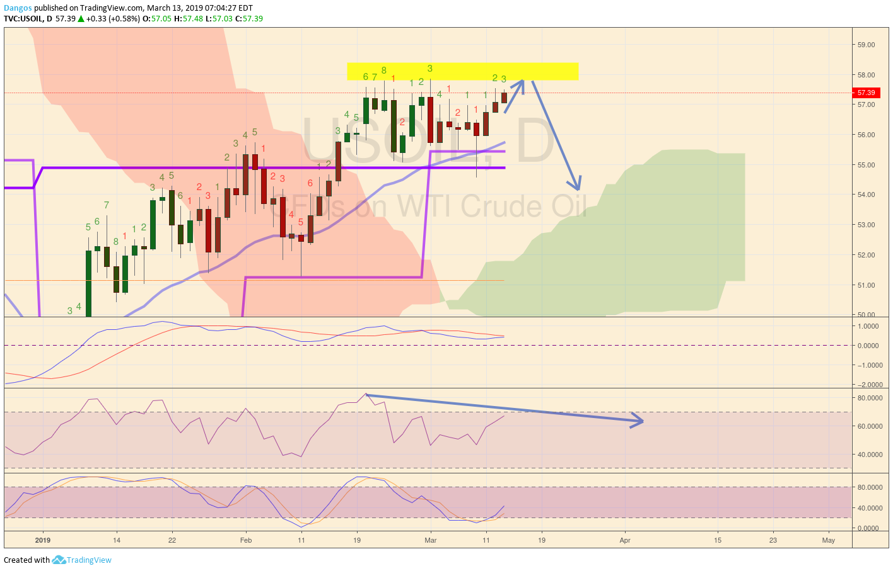
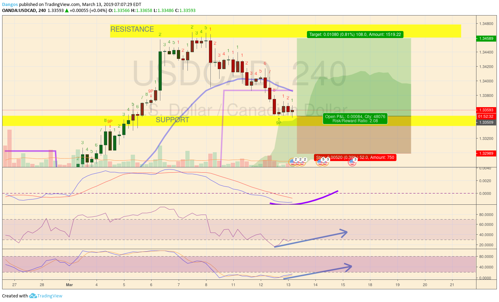

Not sure how to relay information in this blog, as I will be updating my trades periodically.

At the moment, I will post a my in depth thought process heretrade, and [Tradingview](https://www.tradingview.com/chart/USOIL/BWXi4gCU-USDCAD-LONG/) will be a summary of the points desscribed.

Without further adieu, lets begin the trading post.

---

*Just another note, this is actually my second trade in ForEx, as the first one was made before this site was hosted and I am trading with a paper account.*

---

This trade was sparked from my 5 minutes of google [research](https://www.investopedia.com/articles/investing/021315/how-why-oil-impacts-canadian-dollar-cad.asp). This led me to the conclusion that crude oil is positively related to the loonie.

Looking at the daily crude oil chart, we can see that there is a resistance at **~57.88**. With RSI getting lower everytime it hits this resistance, I doubt it would continue going up.

Referencing this with USDCAD. we have several technical confirmations of a potential LONG trade being set up:
1. **MACD** is crossing
2. **RSI** is rising
3. **Stoch RSI** has a crossover
4. **TD Sequential** the green 9P indicates a potential seller exhaustion

I usually enter trades when I get signals from at least 3 indicators, with TD Sequential having the most weight. With that being said, I would like to classify this swing trade with **MEDIUM-LOW** risk, because the longer term timeframes show clear movements.

The Risk Reward ratio for this trade is **1:2**, with the upperbound (**1.346**) being last week's resistance. and lowerbound (**1.330**) being the second level support (backed by previous dynamic pivots).

---

*As always, gamble responsibly, and don't risk more than you can afford to lose (2%)*
